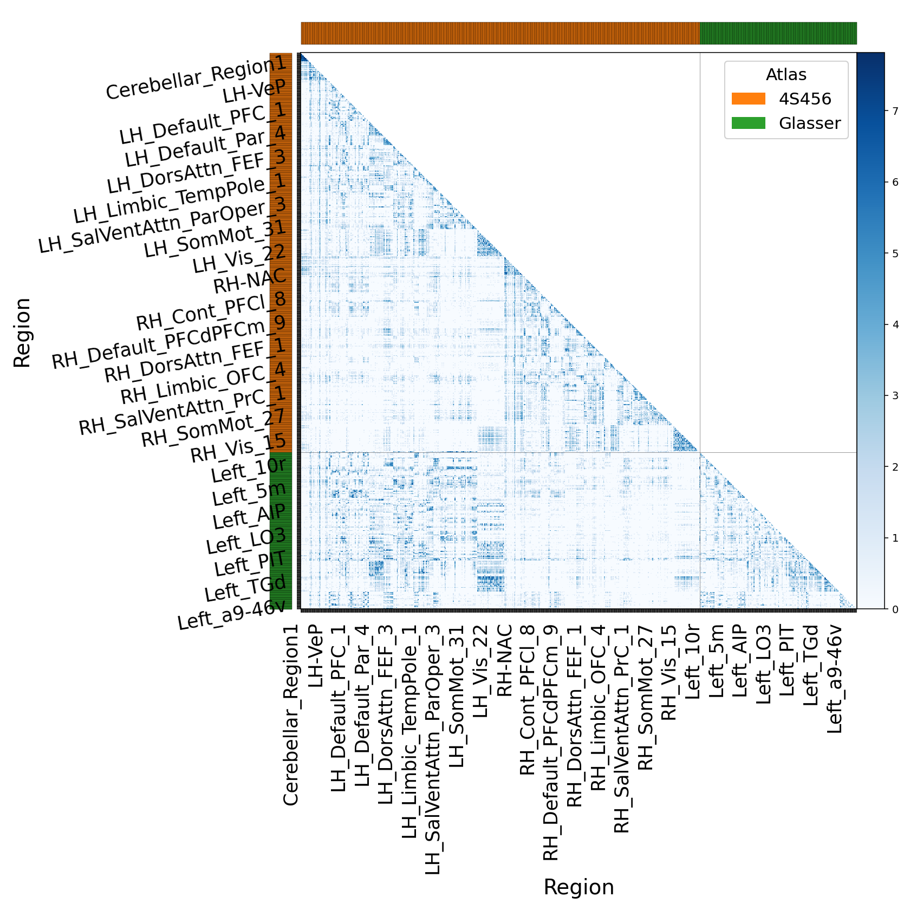
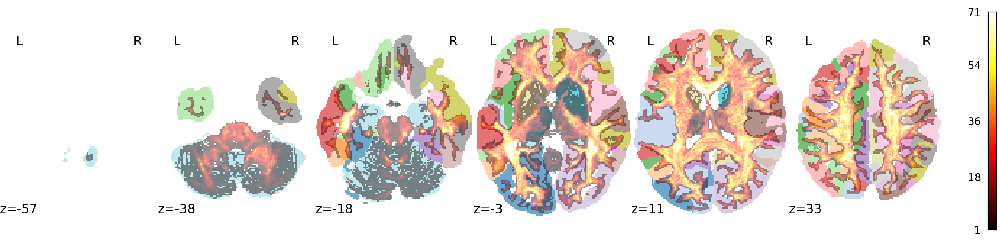
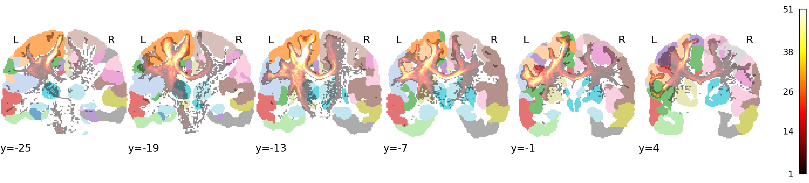

User Guide
==========

The TRX File Format
-------------------

A TRX file is a ZIP archive containing fixed-layout binary arrays:

.. list-table::
   :header-rows: 1
   :widths: 35 65

   * - Entry
     - Content
   * - ``positions.{dtype}``
     - Flat, row-major XYZ triplets in RAS+ space (float16, float32, or float64)
   * - ``offsets.uint<64|32>``
     - Streamline start indices plus a sentinel equal to the total vertex count
   * - ``dps/<name>.<dtype>``
     - Per-streamline scalar fields
   * - ``dpv/<name>.<dtype>``
     - Per-vertex scalar fields
   * - ``groups/<name>/indices.uint32``
     - Streamline indices for a named bundle
   * - ``groups/<name>/dpg/<field>.<dtype>``
     - Per-group scalar metadata
   * - ``header.json``
     - Voxel-to-RAS affine and grid dimensions

Streamline *i* occupies vertices ``offsets[i]`` through ``offsets[i+1] - 1``
in the positions array. The offset array always ends with a sentinel entry
equal to the total vertex count.

Coordinate Systems
------------------

TRX stores positions in **RAS+** (right-anterior-superior), the convention
used by NIfTI and most neuroimaging software. ITK uses **LPS+**
(left-posterior-superior).

This difference is something that users will never need to know about.
All ITK-facing functions accept and return LPS+ coordinates.

Core Classes
------------

.. list-table::
   :header-rows: 1
   :widths: 35 65

   * - Class
     - Role
   * - ``TrxStreamlineData``
     - Central ``DataObject``; lazy positions, AABB queries, group and DPS/DPV access
   * - ``TrxStreamWriter``
     - Incremental streaming writer; fields registered once, then pushed per streamline
   * - ``TrxFileReader`` / ``TrxFileWriter``
     - ``ProcessObject`` wrappers for standard ITK pipeline use
   * - ``TrxGroup``
     - Named bundle; stores streamline indices and DPG fields; lazy subsetting
   * - ``TrxParcellationLabeler``
     - Assigns streamlines to named groups from one or more NIfTI segmentation atlases
   * - ``TrxGroupTdiMapper``
     - Maps a group's streamlines onto a reference grid to produce a track density image

Lazy Loading
------------

When a file is opened through ``TrxFileReader``, positions are **not** decoded
immediately. The backing handle retains a reference to the memory-mapped ZIP
entry; positions are paged in on the first explicit access.

This means that opening a multi-gigabyte tractogram and immediately issuing an
AABB query is fast: only the offset array (a fraction of the total file size)
is read to build per-streamline bounding boxes. Position data for streamlines
outside the query box is never decoded.

The bounding-box cache is built once on the first ``QueryAabb()`` call and
retained for subsequent queries on the same ``TrxStreamlineData`` object.

AABB Queries
------------

``TrxStreamlineData::QueryAabb()`` accepts min and max LPS+ corners and
returns a new ``TrxStreamlineData`` containing streamlines whose bounding
boxes intersect the query region. An optional overload caps the number of
returned streamlines, which is useful for interactive viewer applications:

.. code-block:: cpp

   itk::TrxStreamlineData::PointType minCorner, maxCorner;
   minCorner[0] = -30.0;  minCorner[1] = 5.0;  minCorner[2] = -10.0;
   maxCorner[0] =  -5.0;  maxCorner[1] = 25.0; maxCorner[2] =  15.0;

   // Uncapped
   auto subset = data->QueryAabb(minCorner, maxCorner);

   // Capped at 500 streamlines (random sample when over limit)
   auto preview = data->QueryAabb(minCorner, maxCorner,
                                  /*buildCache=*/false,
                                  /*maxStreamlines=*/500,
                                  /*rngSeed=*/42);

Working with Groups
-------------------

Groups are named collections of streamlines, typically corresponding to
anatomical bundles or cortical parcellation regions. Group membership is stored
as vectors of streamline indices and loaded lazily on first access.

.. code-block:: cpp

   // Enumerate groups
   for (const auto & name : data->GetGroupNames())
   {
     auto group = data->GetGroup(name);
     std::cout << name << ": "
               << group->GetStreamlineIndices().size()
               << " streamlines\n";
   }

   // Get streamlines for one group (lazy subset — no position copy)
   auto group  = data->GetGroup("CST_left");
   auto bundle = group->GetStreamlines(data.GetPointer());

``GetGroup()`` caches results, so repeated calls for the same name are O(1).
``GetStreamlines()`` returns a ``TrxStreamlineData`` subset backed by the
same memory-mapped file.

DPS and DPV Fields
------------------

Per-streamline (DPS) and per-vertex (DPV) scalar fields are enumerated with
``GetDpsFieldNames()`` / ``GetDpvFieldNames()`` and retrieved as ``float``
vectors with ``GetDpsField()`` / ``GetDpvField()``:

.. code-block:: cpp

   for (const auto & name : data->GetDpsFieldNames())
   {
     auto values = data->GetDpsField(name);
     // values.size() == data->GetNumberOfStreamlines()
   }

   for (const auto & name : data->GetDpvFieldNames())
   {
     auto values = data->GetDpvField(name);
     // values.size() == data->GetNumberOfVertices() for scalar fields
   }

Multi-column fields are returned flat in row-major order.

Streaming Writer
----------------

``TrxStreamWriter`` is designed for pipelines that generate streamlines
incrementally, such as tractography algorithms. Fields **must** be declared
before the first ``PushStreamline()`` call. The writer validates that each
push provides all declared fields with consistent lengths, preventing
misaligned arrays in the output archive.

.. code-block:: cpp

   auto writer = itk::TrxStreamWriter::New();
   writer->SetFileName("output.trx");
   writer->UseCompressionOn();

   // Declare fields first
   writer->RegisterDpsField("mean_fa", "float32");
   writer->RegisterDpvField("fa",      "float32");

   // Push streamlines one at a time
   writer->PushStreamline(points,
     /*dps=*/{ { "mean_fa", 0.65 } },
     /*dpv=*/{ { "fa", faPerVertex } });

   // Seal the archive
   writer->Finalize();

Group membership can also be assigned per streamline by passing a list of
group names to ``PushStreamline()``. Groups are written as TRX
``groups/<name>/indices.uint32`` entries when ``Finalize()`` is called.

.. note::

   Calling ``Finalize()`` is required. Omitting it leaves the ZIP archive
   in an incomplete state.

Example Results
---------------

The following figures demonstrate the module working on a representative HCP
subject tractogram parcellated with 4S456 and Glasser atlases.

   Log-scaled connectivity matrix computed from ``ComputeGroupConnectivity()``
   after parcellation. Rows and columns are grouped by atlas; the highlighted
   cell marks the strongest off-diagonal group pair.

   Whole-brain track density image (hot colormap, semi-transparent) overlaid
   on the 4S456 atlas. A quick quality-control check that tract density follows
   plausible white-matter anatomy and is aligned to parcel boundaries.

   Coronal bundle TDI for streamlines intersecting ``Glasser_Left_4`` and
   ``Glasser_Left_6*``, showing expected corticospinal projections and
   verifying local atlas–streamline alignment.

Applying Transforms
-------------------

``TrxStreamlineData`` provides template methods for applying ITK transforms
in place or streaming the result to a writer. The chunked variants process
streamlines in batches to keep memory use bounded:

.. code-block:: cpp

   // Apply transform in place (all positions decoded into memory)
   data->TransformInPlace(transform.GetPointer());

   // Stream transformed positions directly to a writer (memory-efficient)
   data->TransformToWriterChunked(transform.GetPointer(), writer.GetPointer());

The ``vnl_matrix`` buffer overload avoids repeated allocation when processing
many streamlines:

.. code-block:: cpp

   vnl_matrix<double> buffer;
   data->TransformToWriterChunkedReuseVnlBuffer(
       transform.GetPointer(), writer.GetPointer(), buffer);
